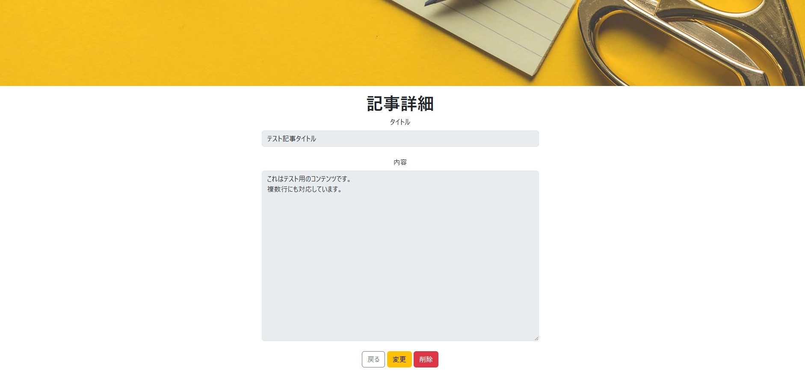

# 記事詳細

## 📌 개요

기사 제목, 본문, 작성자 정보 등을 확인할 수 있으며, 작성자 본인 또는 관리자의 경우 수정 및 삭제 버튼이 활성화됩니다.


## 🖥️ 화면 항목


[イメージを開く](../images/記事詳細.jpg)

| 항목명(논리)    | 항목명(물리) | 타입   | 글자 수 (상한) | 필수 항목   | 설명                      |
|---------------|------------|-------|--------------|------------|---------------------------|
| タイトル（画面）| -         | label  | -            | -          | 「記事詳細」표시            |
| タイトル（記事）| title     | text   | -            | -          | 수정 불가                   |
| 内容           | content   | text   | -           | -           | 수정 불가                    |
| 戻る           | -         | button | -            | -          | 클릭 시 back() 실행          |
| 変更           | -         | button | -            | -          | 로그인 유저의 권한이 admin 이거나 작성자ID와 로그인 유저ID가 일치할 경우 버튼 표시 <br> 클릭 시 articleEdit() 실행   |
| 削除           | -         | button | -            | -          | 로그인 유저의 권한이 admin 이거나 작성자ID와 로그인 유저ID가 일치할 경우 버튼 표시 <br> 클릭 시 articleDelete() 실행 |

## 🧩 컴포넌트 정보

| 항목              | 내용                                      |
|-------------------|-------------------------------------------|
| **컴포넌트명**     | ArticleDetail                           |
| **파일 경로**      | src/components/ArticleDetail.jsx         |


## 🔄 액션 정의

## 🔹 useEffect()

초기 렌더링 시 기사 상세 정보를 서버에서 가져옵니다.
현재 페이지 번호도 Redux를 통해 저장합니다.


###  ① `location.state`에서 가져온 `articleId` 값이 존재하는지 체크합니다.
값이 존재하지 않는 경우, 에러 메세지 표시 후, 기사 일람으로 이동.

```js
alert('記事情報がありません。');
navigate('/ArticleList');
```

###  ②  서버에 기사 상세 정보를 요청합니다.

📄 [記事詳細API 설계서](../api/articel_detail.md)

<BR>
✅ 위의 결과에 에러가 발생하지 않은 경우

1) 레스폰스로 받은 데이터를 상세 정보 state에 저장합니다.
```js
// 記事情報
const [articleInfo, setArticleInfo] = useState({});

↓

// useEffect()
const response = await axios.get(`/api/article_servlet/detail/${articleId}`);
setArticleInfo(response.data);

```
<br>

2) redux에서 관리하고 있는 현재 페이지 번호를 갱신합니다.

```js
dispatch(setPaging({
    currentPage: nowPage,
}));
```
<br>

3) 로컬의 loading state를 false로 갱신하여 화면이 리렌더링 될때 `Loading...` 문구가 표시되지 않도록합니다.

```js
// state 선언
const [loading, setLoading] = useState(true)

↓

// useEffect()
setLoading(false);

↓

// 화면 표시
if (loading) {
    return <div>Loading...</div>; // 로딩 중 메시지
}
```

<br>
❌ 위의 결과에 에러가 발생한 경우 : 에러 메세지 출력 <br>
<br>

| 코드  | 에러 메세지                             |
|:-----|:--------------------------------------|
| 400  | 記事詳細情報を取得時に問題が発生しました。|
| 500  | サーバー（DB）側でエラーが発生しました。  |

---

## 🔹 back()

기사 일람으로 이동합니다.

```js
const back = () => {
    navigate('/ArticleList');
};
```

---

## 🔹 articleEdit()

기사 편집 화면으로 이동합니다. 이때 기사 아이디를 state로 전달합니다.<br>
※admin 권한의 유저만 가능합니다.

```js
const articleEdit = () => {
    navigate('/articleEdit', { state: { articleId: articleInfo.articleId } });
};
```

---

## 🔹 articleDelete()

기사 삭제 화면면으로 이동합니다. 이때 기사 아이디를 state로 전달합니다.<br>
※admin 권한의 유저만 가능합니다.

```js
const articleDelete = () => {
    navigate('/articleDelete', { state: { articleId: articleInfo.articleId } });
};
```