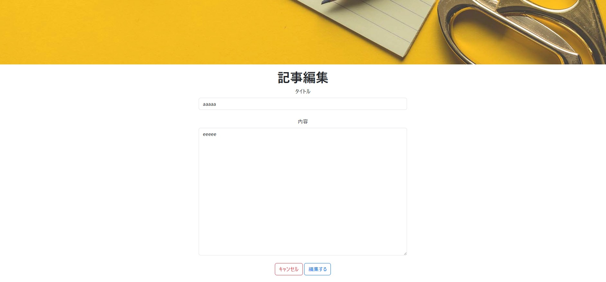

# 記事編集

## 📌 개요

라우팅된 state에서 `articleId`를 받아 기사 정보를 불러오고, 수정 후 저장 처리 및 화면 이동을 수행합니다. <br>
※`admin` 권한이 있는 유저 또는 본인이 등록한 기사만 수행 가능합니다.

## 🖥️ 화면 항목


[イメージを開く](../images/記事編集.jpg)

| 항목명(논리)    | 항목명(물리) | 타입   | 글자 수 (상한) | 필수 항목   | 설명                      |
|---------------|-------------|-------|--------------|------------|---------------------------|
| タイトル（画面）| -          | label  | -            | -          | 「記事編集」표시           |
| タイトル（記事）| title      | text   | 100          | -          | -                        |
| 内容           | content    | text   | 1000         | -          | -                        |
| 編集する        | -         | submit | -            | -          | 클릭 시 btnEdit() 실행 |
| キャンセル      | -         | button | -            | -          | 클릭 시 btnCancel() 실행   |


## 🧩 컴포넌트 정보

| 항목              | 내용                                      |
|-------------------|-------------------------------------------|
| **컴포넌트명**     | ArticleEdit                             |
| **파일 경로**      | src/components/ArticleEdit.jsx           |


## 🔄 액션 정의

## 🔹 displayData()

`useEffect`에서 `displayData()` 함수를 호출하여 서버로부터 기사 상세 정보를 가져옵니다. <br>
가져온 상세 정보는 `setArticleInfo()`를 이용하여 `articleInfo` state에 저장합니다.

📄 [記事詳細API 설계서](../api/articel_detail.md)

<BR>

```jsx
const displayData = async () => {
  try {
    const response = await axios.get(`/api/article_servlet/detail/${location.state.articleId}`);
    setArticleInfo(response.data);
  } catch (error) {
    setErrorFlag(true);
    if (error.response && error.response.status === 400) {
      alert('記事詳細情報を取得時に問題が発生しました。');
    } else if (error.response && error.response.status === 500) {
      alert('サーバー（DB）側でエラーが発生しました。');
    }
  }
};

useEffect(() => {
  displayData();
}, []);

```

---

## 🔹 btnCancel()

기사 상세 화면으로 이동합니다.

```js
const btnCancel = () => {
    navigate('/articleDetail', { state: { articleId: articleInfo.articleId } });
};
```

---

## 🔹 btnEdit()

편집 버튼을 클릭할 경우 실행됩니다. <br>
수정한 기사 정보를 서버에 보내서 기사 정보를 갱신합니다.


###  ① 입력값 유효성 검사

| 항목 | 내용 | 에러 메세지 |
|------|------|------|
| **title** | 미입력 확인  | タイトルを入力してください。|
| **content** | 미입력 확인 | 内容を入力してください。|


###  ② 서버에 편집 API 호출
유효성 검사를 통과한 경우, 서버에 API를 호출합니다.

📄 [記事編集API 설계서](../api/articel_edit.md)

<BR>
✅ 편집 성공 시 기사 일람 화면으로 이동

```js
.then((response) => {
  console.log(response.data);
  if (response.status === 200) {
    setErrorFlag(false);
    navigate('/ArticleList'); // 記事一覧に遷移
  }
})
```

<BR>
❌ 에러가 발생한 경우 : 에러 메세지 출력<BR>

`記事情報が他のユーザーにより削除されました。記事一覧に戻して再操作してください。` <BR>