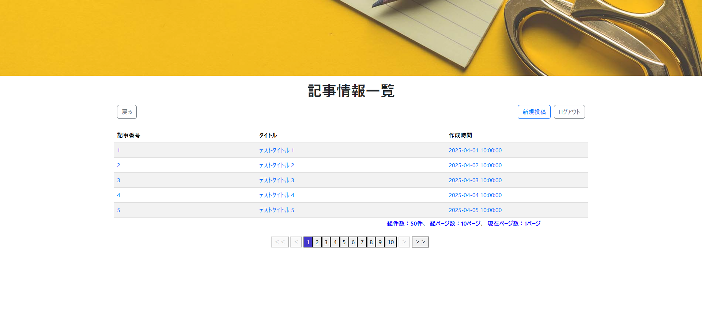

# 記事一覧

## 📌 개요

전체 기사 목록을 페이징 처리와 함께 보여줍니다.
`기사 상세 화면`으로 이동하거나, `新規投稿` 버튼을 통해 새 게시글 작성이 가능합니다.
Redux를 통해 페이징 상태를 관리하며, `PageScreen` 컴포넌트를 통해 페이지 네비게이션을 제공합니다.


## 🖥️ 화면 항목


[イメージを開く](../images/記事情報一覧.png)

| 항목명(논리)     | 항목명(물리) | 타입     | 글자 수 (상한) | 필수 항목 | 설명                           |
|------------------|--------------|----------|----------------|-----------|--------------------------------|
| タイトル         | -            | label    | -              | -         | 「記事情報一覧」표시           |
| 戻る             | -            | button   | -              | -         | 클릭 시 moveMenu() 실행        |
| 新規頭語         | -            | button   | -              | -         | 클릭 시 moveCreate() 실행      |
| ログアウト       | -            | button   | -              | -         | 클릭 시 logOut() 실행          |
| 記事番号         | articleId    | text     | -              | -         | -                              |
| タイトル         | title        | text     | -              | -         | -                              |
| 作成時間         | createdAt    | text     | -              | -         | -                              |
| 総件数           | totalCount   | label    | -              | -         | PageScreen 컴포넌트의 항목, redux paging 상태에서 관리 |
| 総ページ数       | totalPage    | label   | -              | -         | PageScreen 컴포넌트의 항목, redux paging 상태에서 관리 |
| 現在ページ数     | currentPage  | label   | -              | -         | PageScreen 컴포넌트의 항목, redux paging 상태에서 관리 |
| 1ページへ        | -            | button   | -              | -         | PageScreen 컴포넌트의 항목, 클릭 시 firstPage() 호출 |
| 前のページへ     | -            | button   | -              | -         | PageScreen 컴포넌트의 항목, 클릭 시 prevPage() 호출 |
| ページ番号       | -            | button   | -              | -         | PageScreen 컴포넌트의 항목, 클릭 시 changeNowPage() 호출 |
| 次のページへ     | -            | button   | -              | -         | PageScreen 컴포넌트의 항목, 클릭 시 nextPage() 호출 |
| 最後のページへ   | -            | button   | -              | -         | PageScreen 컴포넌트의 항목, 클릭 시 lastPage() 호출 |


## 🧩 컴포넌트 정보

| 항목              | 내용                                        |
|-------------------|---------------------------------------------|
| **컴포넌트명**     | ArticleList                               |
| **파일 경로**      | src/components/ArticleList.jsx                 |


## 🔄 state와 상수

| 변수명                | 설명                                  |
|------------------------|-----------------------------------------|
| articleInfoList      | 기사 일람 정보보을 저장하는 상태               |
| nowPage              | 현재 페이지 번호 상태 (`useState`)      |
| getPaging            | Redux에서 가져온 페이징 정보 (`paging`) |
| displayRecordMaxCount| 한 페이지에 표시할 최대 기사 수 (`5`)   |
| displayMaxPageCount  | 페이징 바에 표시할 최대 페이지 수 (`5`) |


## 🔄 액션 정의

## 🔹 `moveMenu()`
情報一覧メニュー 화면으로 이동

```js
const moveMenu = () => {
  navigate('/menu');
};
```

---

## 🔹 `moveCreate()`
記事投稿 화면으로 이동

```js
const moveCreate = () => {
  navigate('/articleRegist', { state: { nowPage } });
};
```

---

## 🔹 `moveDetail()`
記事詳細 화면으로 이동

```js
const moveDetail = (articleId) => {
  navigate('/ArticleDetail', { state: { articleId, nowPage } });
};
```

---

## 🔹 `logOut()`
로그인 화면으로 이동

```js
const logOut = () => {
  navigate('/');
};
```

---

## 🔹 `fetchData()`
기사 일람 정보 취득

### ① 서버에 파라미터 페이지(pageNo)의 일람 정보를 요청

📄 [記事情報一覧API 설계서](../api/article_list.md)

```js
const response = await axios.get('/api/article_servlet/articleList', {
    params: {
        currentPageNum: pageNo,
        maxRecordCount: displayRecordMaxCount,
        maxPageCount: displayMaxPageCount,
    }
});
```
### ② redux에서 관리하는 페이지네이션 state를 레스폰스 값으로 갱신

```js
const dispatch = useDispatch();
const data = response.data;

dispatch(setPaging({
    currentPage: data.currentPage,
    startPage: data.startPage,
    endPage: data.endPage,
    totalPage: data.totalPage,
    totalCount: data.totalCount,
    displayMaxPage: displayMaxPageCount,
}));
```

### ③ state를 레스폰스 값으로 기사 일람, 현재 페이지 state 갱신

```js
const [articleInfoList, setArticleInfoList] = useState([]);
const [nowPage, setNowPage] = useState(1);

setArticleInfoList(data.infoList);
setNowPage(data.currentPage);
```