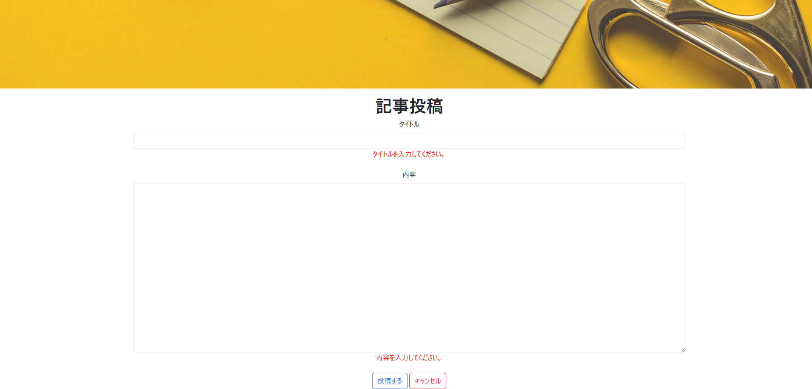

# 記事投稿

## 📌 개요

유저가 기사를 등록할 수 있도록 하는 화면 <BR>
등록 버튼 클릭 시 서버로 데이터를 전송하며, 성공 시 기사 일람 화면으로 리다이렉션됩니다.

## 🖥️ 화면 항목


[イメージを開く](../images/記事投稿.png)

| 항목명(논리)    | 항목명(물리) | 타입   | 글자 수 (상한) | 필수 항목   | 설명                      |
|---------------|-------------|-------|--------------|------------|---------------------------|
| タイトル（画面）| -          | label  | -            | -          | 「記事投稿」표시           |
| タイトル（記事）| title      | text   | 100          | -          | -                        |
| 内容           | content    | text   | 1000         | -          | -                        |
| 投稿する        | -         | submit | -            | -          | 클릭 시 moveArticle() 실행 |
| キャンセル      | -         | button | -            | -          | 클릭 시 btnCancel() 실행   |


## 🧩 컴포넌트 정보

| 항목               | 내용                                 |
|--------------------|--------------------------------------|
| **컴포넌트명**      | ArticleRegist                      |
| **파일 경로**       | src/components/ArticleRegist.jsx    |


## 🔄 액션 정의


## 🔹 `moveArticle()`

등록 버튼 클릭 시 호출되는 함수입니다.

###  ① 입력값 유효성 검사

| 항목 | 내용 | 에러 메세지 |
|------|------|------|
| **title** | 미입력 확인  | タイトルを入力してください。|
| **content** | 미입력 확인 | 内容を入力してください。|


###  ② 서버에 등록 API 호출

유효성 검사를 통과한 경우, 서버에 API를 호출합니다.

📄 [記事投稿API 설계서](../api/article_regist.md)

<BR>
✅ 등록 성공 시 기사 일람 화면으로 이동

```js
navigate('/ArticleList');
```

<BR><BR>
❌ 위의 결과에 에러가 발생한 경우<BR>

`既に同じ記述が登録されています`에러 메세지 출력.<BR>


---

## 🔹 `btnCancel()`
유저 일람으로 이동합니다.

```js
navigate('/UserList');
```
