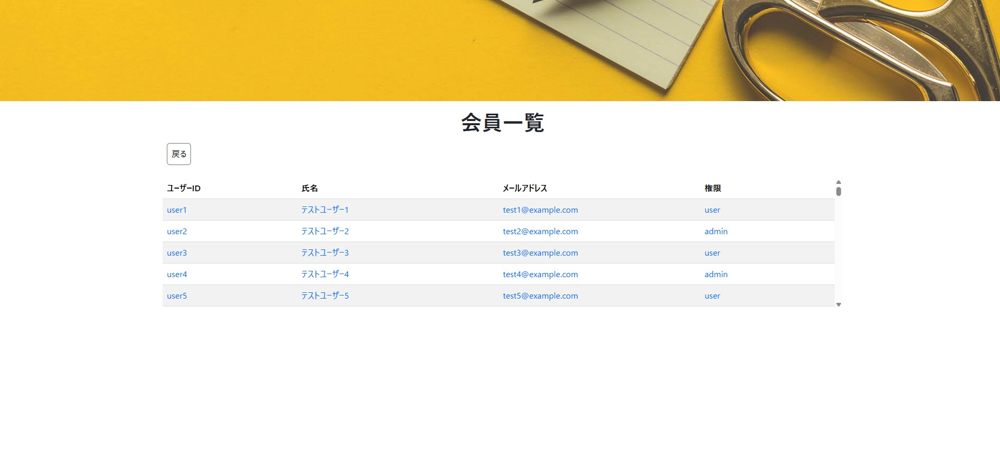

# 会員一覧

## 📌 개요

등록된 모든 사용자 정보를 테이블 형태로 출력하며,
각 사용자 항목을 클릭하면 해당 사용자 상세 정보 페이지로 이동합니다.

## 🖥️ 화면 항목


[イメージを開く](../images/会員一覧.jpg)

| 항목명(논리)   | 항목명(물리) | 타입     | 글자 수 (상한) | 필수 항목 | 설명                   |
|--------------|-------------|---------|----------|-----------|-------------------------|
| タイトル      | -           | label  | -        | -         | 「会員一覧」표시         |
| 戻る          | -           | button | -        | -         | 클릭 시 moveMenu() 실행 |
| ユーザーID     | userId     | label  | -        | -         | -                      |
| 氏名          | name        | label  | -        | -         | -                      |
| メールアドレス | email       | label  | -        | -         | -                      |
| 権限          | authority   | label  | -        | -         | -                      |


## 🧩 컴포넌트 정보

| 항목               | 내용                                  |
|--------------------|--------------------------------------|
| **컴포넌트명**      | UserList                            |
| **파일 위치**       | src/components/UserList.jsx          |


## 🔄 액션 정의

## 🔹 useEffect()
초기 렌더링 시 유저 일람 데이터를 로드합니다.

📄 [会員一覧 API 설계서](../api/user_list.md)

<BR>

```js
axios.get('/api/profile_servlet/usersList',{
      params : {
        "currentPageNum":1,
        "maxRecordCount":100,
        "maxPageCount":5
      }
    })
    .then(response => setUserList(response.data.infoList))
    .catch(error => console.log(error))
```
<BR>
유저 일람 로드에 성공하면 로컬 스테이트 userinfoList를 갱신합니다.

```js
  const [userinfoList, setUserList] = useState([])
```
<BR>

---

## 🔹 `moveMenu()`

메인 메뉴로 돌아가는 기능입니다.

```js
navigate('/menu');
```
<BR>

---

## 🔹 `moveDetail()`

유저 일람 항목 클릭 시 기사 상세 페이지로 이동합니다.<BR>
유저 상세 페이지로 이동하려했던 것인지 확인이 필요합니다.

```js
  const moveDetail = (articleId) => {
    navigate('/article-detail', { state: { articleId } });
  };
```